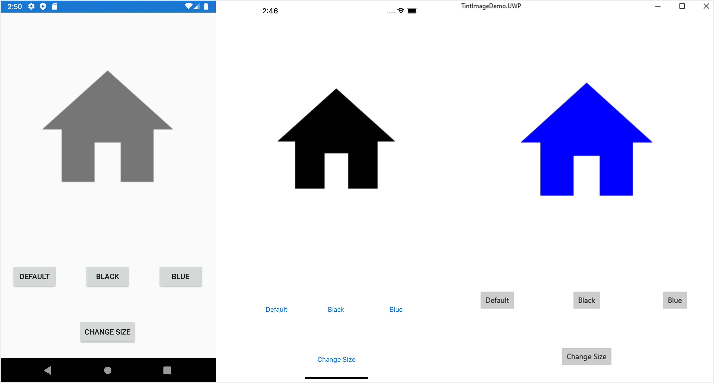

Xamarin.Forms.TintImage
================
TintImage is an extended [Image](https://docs.microsoft.com/en-us/dotnet/api/xamarin.forms.image?view=xamarin-forms). It allows you to customize the foreground of an image with different colors. It is possible to change color even in the runtime. Set the `TintColor` to `Transparent` to cancel the tint effect.

  

Refer my below post for more details and step by step instructions to create and use the TintImage in a Xamarin.Forms application.
https://xdevlogs.com/2020/06/15/tintimage-xamarin-forms/ 

### Final output

The final outcome of the demo in Android, iOS and UWP is shown below. 

  

## UWP References

* https://stackoverflow.com/questions/36136521/uwp-transparent-png-color-overlay
* https://docs.microsoft.com/en-us/windows/uwp/composition/composition-brushes
* https://www.nuget.org/packages/CompositionProToolkit/

Author
======
Harikrishnan